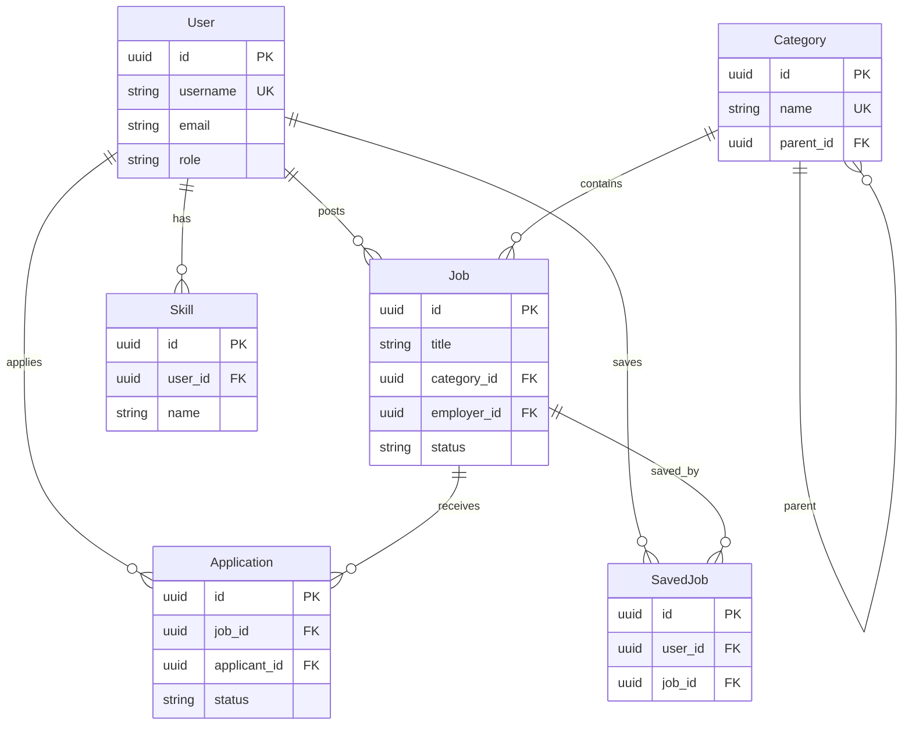

# Database ERD - Mermaid Diagram
## Job Board Platform

This Mermaid ERD diagram represents the complete database schema with all 35 entities and their relationships.

## Full ERD Diagram

```mermaid
erDiagram
    %% Core Entities
    User {
        uuid id PK
        string username UK
        string email
        string password
        string first_name
        string last_name
        string role
        string phone_number
        image profile_picture
        text bio
        boolean is_active
        boolean is_staff
        boolean is_superuser
        datetime date_joined
        datetime last_login
        datetime created_at
        datetime updated_at
    }

    Category {
        uuid id PK
        string name UK
        text description
        uuid parent_id FK
        string slug UK
        datetime created_at
        datetime updated_at
    }

    %% User Profile Entities
    Skill {
        uuid id PK
        uuid user_id FK
        string name
        string level
        integer years_of_experience
        datetime created_at
        datetime updated_at
    }

    Education {
        uuid id PK
        uuid user_id FK
        string institution
        string degree
        string field_of_study
        date start_date
        date end_date
        boolean is_current
        text description
        datetime created_at
        datetime updated_at
    }

    WorkHistory {
        uuid id PK
        uuid user_id FK
        string company
        string position
        date start_date
        date end_date
        boolean is_current
        text description
        string location
        datetime created_at
        datetime updated_at
    }

    Portfolio {
        uuid id PK
        uuid user_id FK
        string title
        text description
        url url
        string technologies
        date start_date
        date end_date
        boolean is_featured
        datetime created_at
        datetime updated_at
    }

    SocialLink {
        uuid id PK
        uuid user_id FK
        string platform
        url url
        boolean is_public
        datetime created_at
        datetime updated_at
    }

    UserPreferences {
        uuid id PK
        uuid user_id FK
        boolean email_job_alerts
        boolean email_application_updates
        boolean email_new_jobs
        boolean email_newsletter
        string alert_frequency
        string profile_visibility
        boolean show_email
        boolean show_phone
        boolean show_location
        string resume_visibility
        datetime created_at
        datetime updated_at
    }

    SavedJob {
        uuid id PK
        uuid user_id FK
        uuid job_id FK
        text notes
        datetime created_at
    }

    %% Job & Application Entities
    Job {
        uuid id PK
        string title
        text description
        text requirements
        uuid category_id FK
        uuid employer_id FK
        string location
        string job_type
        decimal salary_min
        decimal salary_max
        string status
        string approval_status
        uuid approved_by_id FK
        datetime approved_at
        datetime scheduled_publish_date
        datetime expires_at
        boolean auto_renew
        integer renewal_count
        date application_deadline
        boolean is_featured
        integer views_count
        datetime created_at
        datetime updated_at
    }

    Application {
        uuid id PK
        uuid job_id FK
        uuid applicant_id FK
        text cover_letter
        file resume
        string status
        datetime applied_at
        datetime reviewed_at
        text notes
        boolean is_withdrawn
        datetime withdrawn_at
        text withdrawal_reason
        uuid template_id FK
    }

    ApplicationNote {
        uuid id PK
        uuid application_id FK
        uuid author_id FK
        text note
        integer rating
        boolean is_internal
        datetime created_at
        datetime updated_at
    }

    ApplicationStatusHistory {
        uuid id PK
        uuid application_id FK
        string old_status
        string new_status
        uuid changed_by_id FK
        text reason
        datetime changed_at
    }

    ScreeningQuestion {
        uuid id PK
        uuid job_id FK
        text question
        string question_type
        boolean is_required
        integer order
        json options
        datetime created_at
    }

    ScreeningAnswer {
        uuid id PK
        uuid application_id FK
        uuid question_id FK
        text answer
        datetime created_at
    }

    ApplicationStage {
        uuid id PK
        uuid application_id FK
        string stage_type
        string stage_name
        integer order
        boolean is_completed
        datetime completed_at
        text notes
        datetime created_at
        datetime updated_at
    }

    Interview {
        uuid id PK
        uuid application_id FK
        datetime scheduled_at
        integer duration
        string interview_type
        string location
        url video_link
        uuid interviewer_id FK
        text notes
        boolean is_confirmed
        datetime created_at
        datetime updated_at
    }

    ApplicationScore {
        uuid id PK
        uuid application_id FK
        float overall_score
        float experience_score
        float skills_score
        float education_score
        float screening_score
        text notes
        uuid scored_by_id FK
        datetime scored_at
        datetime updated_at
    }

    ApplicationTemplate {
        uuid id PK
        uuid employer_id FK
        string name
        text description
        text default_notes
        boolean is_active
        datetime created_at
        datetime updated_at
    }

    ApplicationSource {
        uuid id PK
        uuid application_id FK
        string source_type
        url referrer_url
        string campaign
        string utm_source
        string utm_medium
        string utm_campaign
        datetime created_at
    }

    %% Search & Analytics Entities
    JobView {
        uuid id PK
        uuid job_id FK
        uuid user_id FK
        ip_address ip_address
        string user_agent
        url referrer
        datetime viewed_at
    }

    JobShare {
        uuid id PK
        uuid job_id FK
        uuid user_id FK
        string method
        string shared_with
        datetime shared_at
    }

    JobRecommendation {
        uuid id PK
        uuid user_id FK
        uuid job_id FK
        float score
        string reason
        datetime created_at
        boolean viewed
        boolean clicked
    }

    JobAnalytics {
        uuid id PK
        uuid job_id FK
        integer total_views
        integer unique_views
        integer total_applications
        integer shares_count
        integer saved_count
        datetime last_updated
    }

    SearchHistory {
        uuid id PK
        uuid user_id FK
        string search_query
        json filters
        integer result_count
        ip_address ip_address
        datetime created_at
    }

    SavedSearch {
        uuid id PK
        uuid user_id FK
        string name
        string search_query
        json filters
        boolean is_active
        datetime created_at
        datetime updated_at
        datetime last_searched_at
    }

    SearchAlert {
        uuid id PK
        uuid user_id FK
        uuid saved_search_id FK
        string name
        string search_query
        json filters
        string frequency
        boolean is_active
        datetime last_notified_at
        integer last_job_id
        datetime created_at
        datetime updated_at
    }

    PopularSearchTerm {
        uuid id PK
        string term UK
        integer search_count
        datetime last_searched_at
        datetime first_searched_at
    }

    %% System & Security Entities
    Notification {
        uuid id PK
        uuid user_id FK
        string notification_type
        string title
        text message
        string priority
        boolean is_read
        datetime read_at
        url action_url
        string related_object_type
        string related_object_id
        json metadata
        datetime created_at
    }

    NotificationPreference {
        uuid id PK
        uuid user_id FK
        boolean in_app_job_applications
        boolean in_app_application_updates
        boolean in_app_new_jobs
        boolean in_app_messages
        boolean in_app_system
        string notification_frequency
        datetime created_at
        datetime updated_at
    }

    AuditLog {
        uuid id PK
        uuid user_id FK
        string action
        uuid content_type_id FK
        string object_id
        string object_repr
        json changes
        ip_address ip_address
        string user_agent
        string request_path
        string request_method
        json metadata
        datetime created_at
    }

    ChangeHistory {
        uuid id PK
        uuid content_type_id FK
        string object_id
        uuid changed_by_id FK
        string field_name
        text old_value
        text new_value
        text change_reason
        datetime created_at
    }

    APIKey {
        uuid id PK
        string name
        string key UK
        uuid user_id FK
        boolean is_active
        datetime last_used_at
        datetime expires_at
        integer rate_limit
        text allowed_ips
        json scopes
        datetime created_at
        datetime updated_at
    }

    IPWhitelist {
        uuid id PK
        ip_address ip_address UK
        string description
        boolean is_active
        uuid created_by_id FK
        datetime created_at
        datetime updated_at
    }

    SecurityEvent {
        uuid id PK
        string event_type
        uuid user_id FK
        ip_address ip_address
        string user_agent
        json details
        datetime created_at
    }

    %% Relationships - User Profile
    User ||--o{ Skill : "has"
    User ||--o{ Education : "has"
    User ||--o{ WorkHistory : "has"
    User ||--o{ Portfolio : "has"
    User ||--o{ SocialLink : "has"
    User ||--|| UserPreferences : "has"
    User ||--o{ SavedJob : "saves"
    User ||--o{ NotificationPreference : "has"

    %% Relationships - Category
    Category ||--o{ Category : "parent"
    Category ||--o{ Job : "contains"

    %% Relationships - Job
    User ||--o{ Job : "posts"
    User ||--o{ Job : "approves"
    Job ||--o{ Application : "receives"
    Job ||--o{ SavedJob : "saved_by"
    Job ||--o{ JobView : "viewed"
    Job ||--o{ JobShare : "shared"
    Job ||--o{ JobRecommendation : "recommended"
    Job ||--|| JobAnalytics : "has"
    Job ||--o{ ScreeningQuestion : "has"

    %% Relationships - Application
    User ||--o{ Application : "applies"
    Application ||--o{ ApplicationNote : "has"
    Application ||--o{ ApplicationStatusHistory : "tracks"
    Application ||--o{ ScreeningAnswer : "has"
    Application ||--o{ ApplicationStage : "has"
    Application ||--o{ Interview : "has"
    Application ||--|| ApplicationScore : "scored"
    Application ||--|| ApplicationSource : "tracked"
    ApplicationTemplate ||--o{ Application : "used_in"
    ScreeningQuestion ||--o{ ScreeningAnswer : "answered_by"
    User ||--o{ ApplicationNote : "writes"
    User ||--o{ ApplicationStatusHistory : "changes"
    User ||--o{ Interview : "conducts"
    User ||--o{ ApplicationScore : "scores"
    User ||--o{ ApplicationTemplate : "creates"

    %% Relationships - Search & Analytics
    User ||--o{ SearchHistory : "searches"
    User ||--o{ SavedSearch : "saves"
    User ||--o{ SearchAlert : "creates"
    User ||--o{ JobView : "views"
    User ||--o{ JobShare : "shares"
    User ||--o{ JobRecommendation : "receives"
    SavedSearch ||--o{ SearchAlert : "triggers"

    %% Relationships - System & Security
    User ||--o{ Notification : "receives"
    User ||--o{ AuditLog : "performs"
    User ||--o{ ChangeHistory : "makes"
    User ||--o{ APIKey : "owns"
    User ||--o{ IPWhitelist : "creates"
    User ||--o{ SecurityEvent : "triggers"
```

---

## Simplified ERD (Key Entities Only)

If the full diagram is too complex, here's a simplified version focusing on core relationships:

---

## How to Use This Mermaid Diagram

### Option 1: GitHub/GitLab
- Simply paste the Mermaid code in a `.md` file
- GitHub and GitLab automatically render Mermaid diagrams

### Option 2: Mermaid Live Editor
1. Go to https://mermaid.live/
2. Paste the Mermaid code
3. Export as PNG/SVG/PDF
4. Insert into Google Doc

### Option 3: VS Code
1. Install "Markdown Preview Mermaid Support" extension
2. Open this `.md` file
3. Preview to see the diagram
4. Export or screenshot

### Option 4: Online Tools
- **Mermaid.ink**: https://mermaid.ink/
- **Mermaid Chart**: https://www.mermaidchart.com/
- **Notion**: Supports Mermaid natively

### Option 5: Google Docs
1. Use Mermaid Live Editor to export as PNG
2. Insert image into Google Doc
3. Or use a Mermaid add-on for Google Docs

---

## Diagram Notes

### Relationship Symbols:
- `||--||` : One-to-One (required)
- `||--o|` : One-to-One (optional)
- `||--o{` : One-to-Many
- `}o--o{` : Many-to-Many

### Key Design Features:
- All entities use UUID primary keys
- Foreign keys maintain referential integrity
- Unique constraints prevent duplicates
- Indexes optimize query performance
- Cascade deletes maintain data consistency

### Entity Groups:
- **Core**: User, Category
- **User Profile**: Skill, Education, WorkHistory, Portfolio, SocialLink, UserPreferences, SavedJob
- **Job & Application**: Job, Application, and 9 enhancement entities
- **Search & Analytics**: 8 entities for search and analytics
- **System & Security**: 7 entities for notifications, audit, and security

---

## Export Instructions

1. **Copy the Mermaid code** from the full ERD section above
2. **Go to https://mermaid.live/**
3. **Paste the code** in the editor
4. **Click Export** → Choose format (PNG recommended)
5. **Download** the image
6. **Insert into Google Doc** as image

---

## Alternative: Split into Multiple Diagrams

If a single diagram is too large, you can create separate diagrams for each entity group:

### 1. Core & User Profile
### 2. Job & Application
### 3. Search & Analytics
### 4. System & Security

Then combine them in your Google Doc.

---

**This Mermaid diagram provides a complete visual representation of your database schema!**
