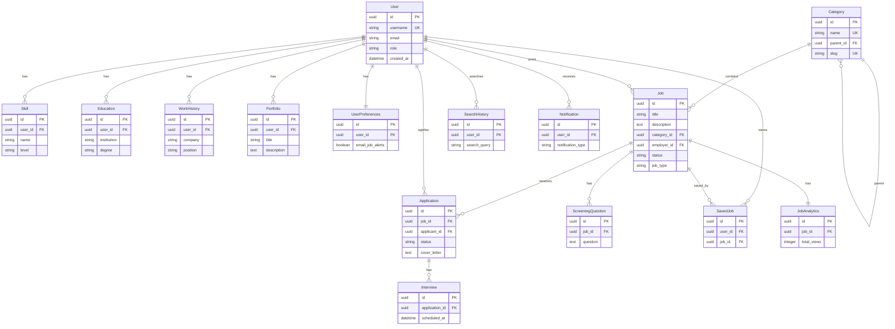

# Simplified Mermaid ERD
## Job Board Platform - Core Relationships

This is a simplified version focusing on the most important entities and relationships. Use this if the full diagram is too complex to render.

---

## How to Use

1. **Copy the Mermaid code above**
2. **Go to https://mermaid.live/**
3. **Paste and view the diagram**
4. **Export as PNG/SVG**
5. **Insert into Google Doc**

---

## Full Version Available

For the complete ERD with all 35 entities, see `ERD_MERMAID.md`
